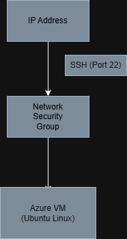
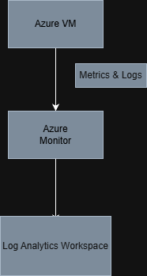

# Azure Secure VM Monitoring & Access Control (Free-Tier Lab)

This project demonstrates the deployment, security hardening, and monitoring of a Linux virtual machine in Microsoft Azure using free-tier compatible services. The focus is on identity-aware access, network security, operational monitoring, and cost control.

---

## Project Goals

- Deploy a secure Linux virtual machine in Azure
- Restrict network access using least-privilege principles
- Enable monitoring and log collection
- Validate operational visibility
- Maintain zero ongoing cost through controlled teardown

---

## Azure Services Used

- Azure Virtual Machines (Linux)
- Network Security Groups (NSG)
- Azure Monitor
- Log Analytics Workspace
- Azure Resource Groups

All services were selected to remain within free-tier or minimal-cost limits.

---

## Architecture Overview

### Secure Network Design

### Monitoring & Logging Flow

---

## Implementation Summary

### 1. Resource Isolation
- Created a dedicated resource group to isolate the project lifecycle
- Enabled easy cleanup and cost control

### 2. Secure VM Deployment
- Deployed an Ubuntu Linux VM using SSH key authentication
- Disabled password-based access
- Used a burstable VM size compatible with free-tier constraints

### 3. Network Security
- Implemented Network Security Group rules to:
  - Allow SSH (port 22) only from a single trusted IP address
  - Deny all other inbound traffic by default

### 4. Monitoring & Logs
- Enabled Azure Monitor and VM Insights
- Connected the VM to a Log Analytics workspace
- Collected CPU, disk, and network metrics
- Queried heartbeat and operational logs

### 5. Validation
- Successfully connected to the VM via SSH
- Generated activity to validate metric and log ingestion

---

## Cost Management

- Resources were stopped immediately after validation
- Project resources can be deleted by removing the resource group
- No services were left running to avoid unexpected charges

